# microsoft-sccm-lab
This guide provides a comprehensive, step-by-step walkthrough for building a fully functional Microsoft Endpoint Configuration Manager (SCCM/MECM) home lab using VirtualBox. Perfect for IT professionals preparing for certifications, learning SCCM administration, or testing deployment scenarios in a safe environment. The lab consists of three virtual machines: a Windows Server 2022 Domain Controller with DNS and DHCP, a Windows Server 2022 SCCM Primary Site Server with SQL Server 2019, and a Windows 10/11 client for testing deployments. All components are configured to work together in an isolated network environment, allowing you to practice application deployment, operating system deployment, software updates, compliance settings, and reporting without affecting production systems. The entire setup requires approximately 8-10 hours to complete and assumes basic knowledge of Windows Server, Active Directory, and virtualization concepts.  

Windows 2022 Server download: https://www.microsoft.com/en-us/evalcenter/download-windows-server-2022  
Windows 10/11 Enterprise: https://www.microsoft.com/en-us/evalcenter/evaluate-windows-11-enterprise  
SQL Server Developer Edition download: https://www.microsoft.com/en-us/sql-server/sql-server-downloads  
Microsoft Endpoint Configuration Manager Current Branch (SCCM): https://info.microsoft.com/ww-landing-microsoft-endpoint-configuration-manager.html?culture=en-us&country=us  
Windows Assessment and Deployment Kit ADK: https://learn.microsoft.com/en-us/windows-hardware/get-started/adk-install  

First go and setup the NAT Network that will be used:  
SCCM Lab: 192.168.10.0/24  

Setup:  
VM1: Domain Controller  
Memory: 4096 MB  
Space: 60 GB  
Network: NAT Network on Adapter 1  (SCCM Lab)
Processer: 2 CPUs  
Version: Windows 2022

VM2: SCCM01  
Processer: 4 CPUs  
Network: NAT Network on Adapter 1  (SCCM Lab)
Memory: 12288 MB  
Space: 150 GB  

VM3: Client  
Memory: 4096 MB  
Network: NAT Network on Adapter 1  
Space: 60 GB  

# Setting up VM1  
After starting it up you will be greeted by this screen and press next:  
  
Then click on install now and wait a couple seconds and you will see this screen, go to the second option:  
  
Click on next until see the option for custom installation, click on it and continue and then wait a while for the VM to install.  
After waiting a while, you will be greeted with this screen:  
  
Set the Admin password as something that can easily remembered and write it down. Then sign in when prompted and wait it for it boot up.  
After booting up:  
  
Then click on Local Server, then Ethernet,  
  
Then double click on it to open up the Ethernet Status, then click on properties, then click on TCP/IPv4, and enter in this information:  
  
Then click on OK twice, and restart the VM and login again ad the Admin account.  
After it restarts click on Manage and click on Add roles and features.  
Then click on next a couple times till you hit server roles and check Active Directory Domain Services, then hit next a couple more times and click on install and wait a few minutes, then click close.  
Then click on the yellow triangle icon and click promote to domain controller, and then click on add a new forest and call it lab.local and click on next and set a password for the DSRM that can be remembered.  
Then hit next for Create DNS and for NetBIOS name it LAB and hit next, until the prerequisite check and after its done click on install and wait for it to restart.  
After restarting, sign in as admin in the LAB NetBIOS name with the password that was set.  
Then go back to manage and click on add roles and features once again and click on next a couple more times until you get to server roles and click on DHCP Server this time and click next a couple more times, then click on install and wait.  
Once its done click on the flag icon and click on complete DHCP configuration, click on next, then commit and close it out.  
Then in Server Manager click on tools and then DHCP:  
  
Right click on IPv4 and choose New Scope and name the scope SCCMLab Scope and hit next and enter this for the IP configuration:  
  
Then hit next a couple times with the lease duration set to 8 days and select yes to configuring the options now and make the default gateway 192.168.10.1, add it and hit next.  
Then continue hitting next until you see finish and click on it.  
Then go to tools and go to Active Directory Users and Computers and expand lab.local and right click on users and create 3 new users:  

Account 1:  
First name: SCCM Admin  
Logon: sccmadmin  
Password: something easily remembered, and uncheck at next login, and never expires and click on next and finish.  

Account 2:
First name: SQL Service  
Logon: sqlservice  
Password: something easily remembered, and uncheck at next login, and never expires.  

Account 3:  
SCCM NAA  
Logon: sccmnaa  
Password: something easily remembered, and uncheck at next login, and never expires.  

Then refresh lab.local and go the SCCMAdmin user, what its suppose to look like:  
  
Then right click on sccmadmin user and choose properties, then go to member of tab and click add and type Domain Admins, check names to verify and click on ok, then appy and then ok.  

# Setting up VM2
Click on new and create the VM, and set it to Microsoft Windows version 2022 G4 Bit.  
Memory: 12288 MB or 12 GB.  
Video Memory: 128 MB  
Space: 150 GB  
Processors: 4 or 5  
Network: NAT Network set to SCCM Lab. 
Network2: NAT   
Then attach the Windows Server 2022 ISO to the storage.  

Then start the VM and follow the installation steps similiar to the first VM.  
Click next on the first screen then install now, then for OS select the second opption for standard evaluation, then click on custom so you can see the unallocated space option for the drive.  
Then wait for a while for the VM to get up and installed.  
Then after a few minutes, the screen to customize settings will pop up to set the password and username. After setting the password, click finish and then you will see the login screen.  
After a few seconds the server manager should appear.  
  
Then go to Local Server and click on Ethernet:  
  
After clicking on the thing beside it:  
  
Then right click on Ethernet -> then Properties and then double click on IPv4 and enter in this info:  
  
Then click on OK twice and and close it out.  
Then go to in Local Server and click on Computer Name:  
  
Click on change and name it SCCM01 and the domain type lab.local and then click on OK.  
*Make sure to have the DC up and running during this*  
After clicking on OK you will see this:  
  
After entering in the correct credentials you will see this:  
  
Then click OK a couple times and then go and restart the VM.  
After restarting you should see the Other User option pop up:  
  
Click on Other User and sign as the SCCMAdmin user account that was created.  
After waiting for a few seconds you should see this:  
  
Then go to the Server Manager and click on Manage -> Add Roles and Features, then click on Web Server.  
Then go check .Net Extensibility 3.5 and 4.8, ASP.NET 3.5 and ASP.NET 4.8 and their sub items, check IIS 6 and its subs, Security with windows authentication checked and a couple others.  
Then click next till installation review, check restart, hit yes and then install.  
After waiting for a few minutes, then click close and then its time to mount the SQL Server ISO.  
Download from above and turn off the VM, then go to settings -> storage and then click on the optical drive option:  
  
*The first option*  
  
Make sure to download from the third option and after downloading, run the installer and you will see this screen:  
  
Click on Download Media and you will see this screen:  
  
Select the ISO File and then click download and the download media process will begin, then wait for a few minutes and it should appear in Downloads
  
Then go back to the SCCM VM settings and get it mounted.  
After clicking on Optical Drive option you will the medium selecter screen, then click on the add option:  
  
After clicking on add, go and find the SQL iso file click choose and it should appear in the storage part:  
  
Click OK and get the VM back up to install SQL Server in the VM.  
After signing back in, go the file folder and you should see the SQL Server folder in there:  
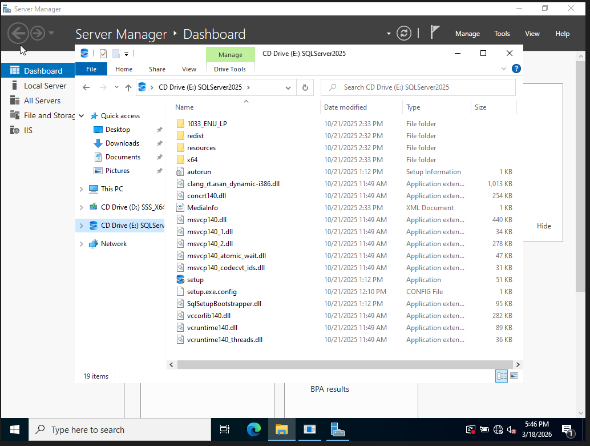
Then click on setup.exe and wait for a couple seconds.  
After waiting this screen will appear:
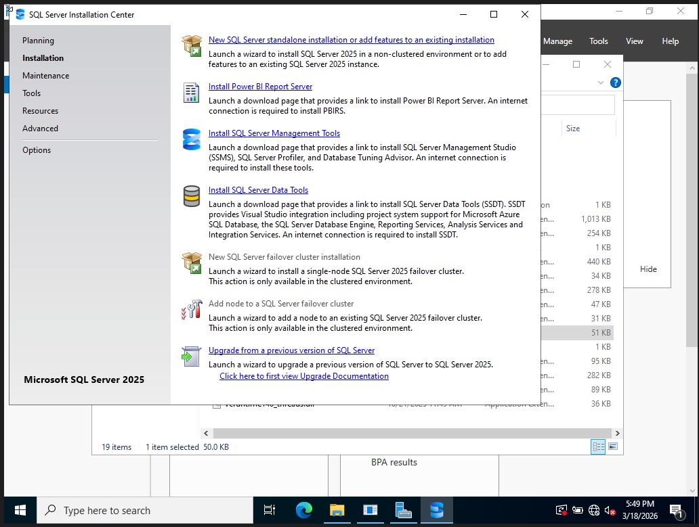    
Then click on New SQL Server stand-alone installation, select evaluation edition and hit next.  
Then accept the terms, hit next, make sure to uncheck Microsoft Update and hit next, next again, then wait for setup files to install.  
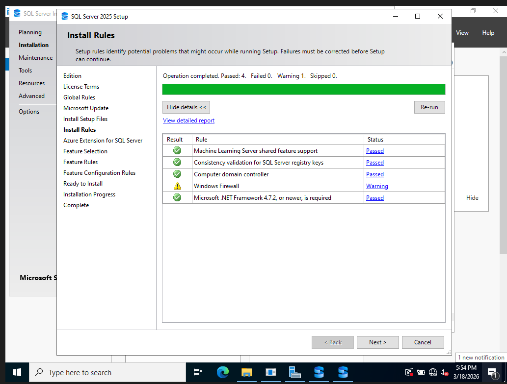    
Then hit next, in sql server feature selection, select database engine services, then the full text option, then hit next, for instance configuration keep it at default instance and hit next. 
Then in SQL Server Configuration, go to the service accounts and change the info for SQL Server Database Engine and SQL Server Agent by clicking on account name, then dropdown menu, click on browse, enter in LAB\sqlservice, then click on OK and in password, type the password like so:   
  
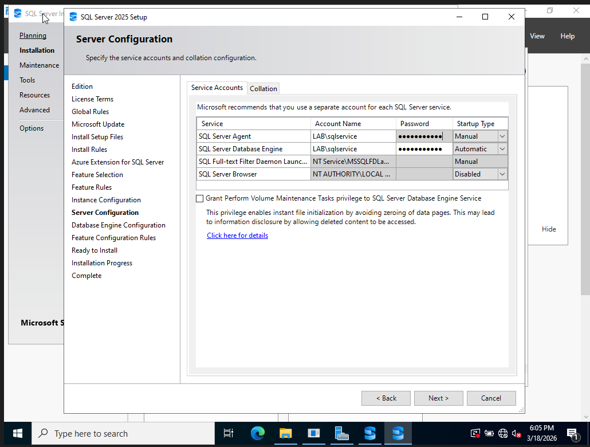
Then go to the Collation tab and make sure its set to SQL_LATIN1_General_CP1_CI_AS like so: 
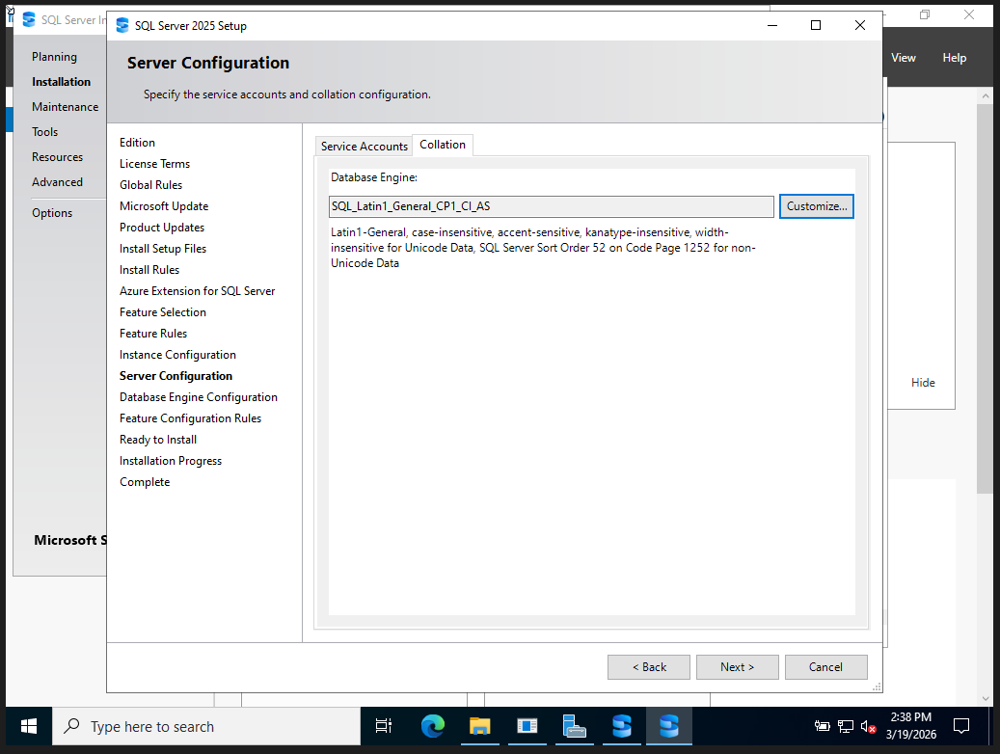    
Then hit next, on server configuration, select mixed mode, then enter in SCCM Admin's password, then select current user. Then move on the tab for Data Directories and accept the defaults, then move on to TempDB and accept the defaults.    
Then hit next till install and wait for a few minutes. After waiting for a few minutes, you should see the installation has completed. Select close. Then go to Microsofts site and download SSMS and install it.   
After installing, go to start and search for SQL Server Management Studio, then open SQL Server Configuration Manager and navigate to TCP/IP section within SQL Server Network Config like so:  
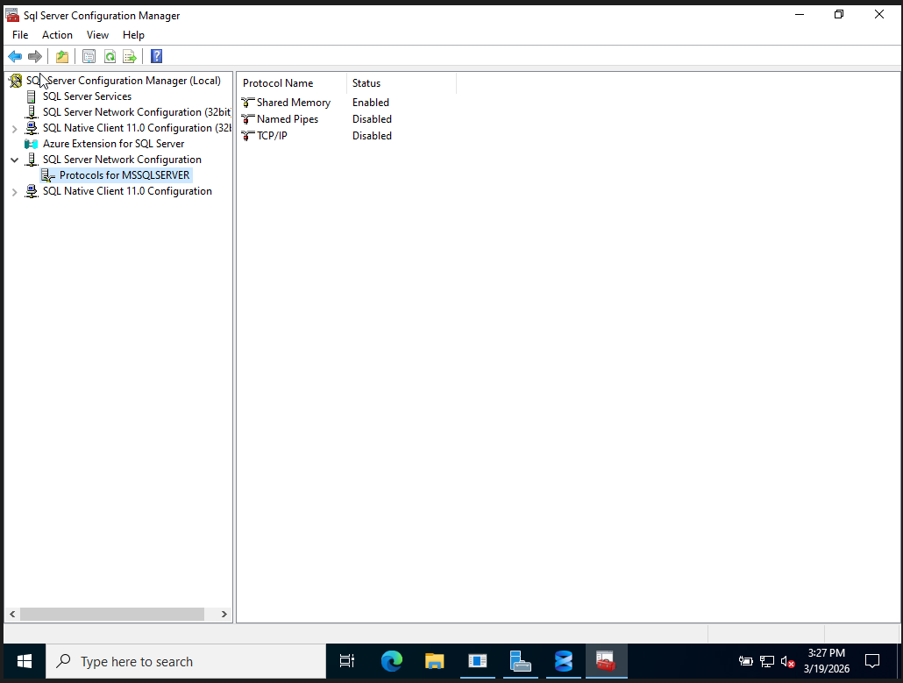   
Then right click on TCP/IP and enable it. Then close out of Config Manager and get Server Management Studio up. 
In the first menu, select skip and add later. When connecting to the local SQL Server, click on browse and look at local like so:
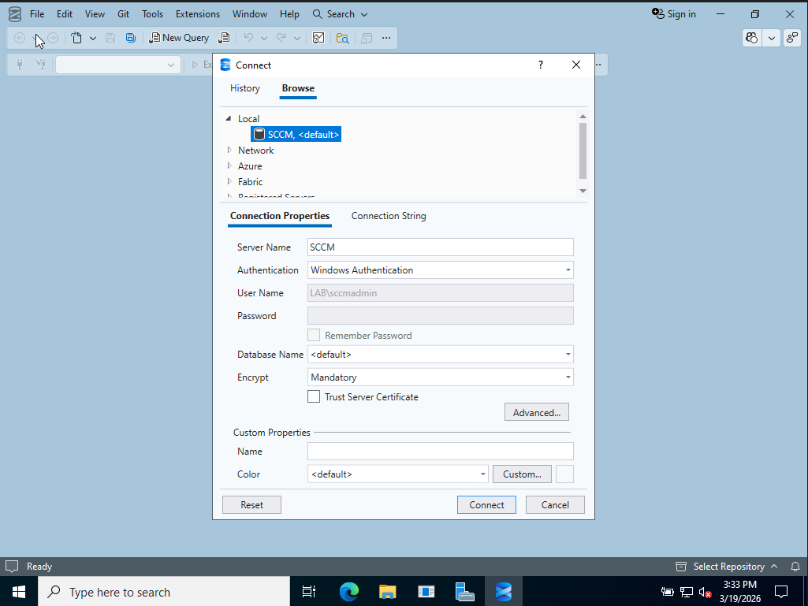
Make sure to make encryption optional, then click on connect.   
Then you should see the SQL Server, then right click on the name and click on properties and go to memory.  
On memory, set the maximum to 4096 and click on OK
Then get the SCCM iso into it, like with the SQL Server one.    
You will however have to burn a iso using Anyburn after downloading relavant files.  
After getting it up, you should be able to see it.  
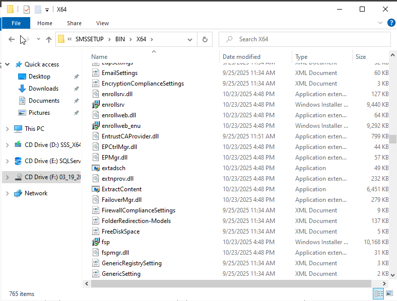  
Right click on the file named extadsch.exe and run it as admin. 
A command prompt windows will pop for a few seconds, then close. Then go to the normal C:\ folder and look for a file like so:  
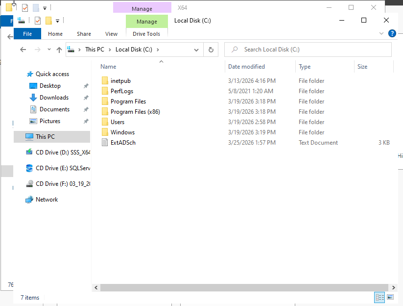    
Then open the file  
*Note this should be run in the DC01 and not the second VM*
What it should look like in DC01 after running: 
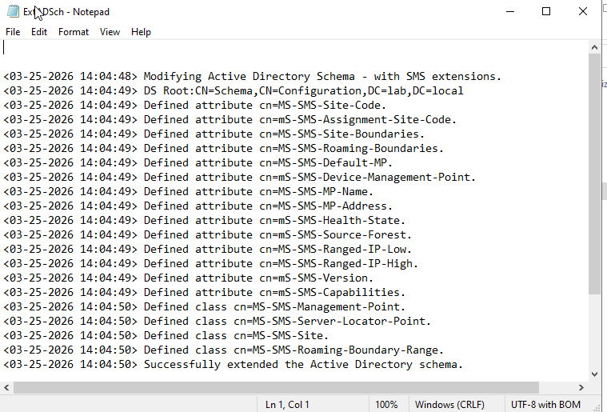  
Then in Server Manager, go to tools and select ADSI Edit and see this:  
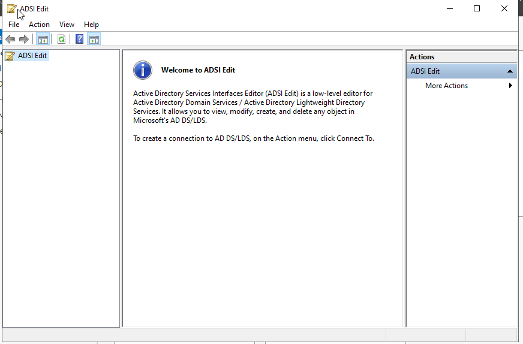 
Right click on ADSI Edit and select connect to. 
You should see this:    
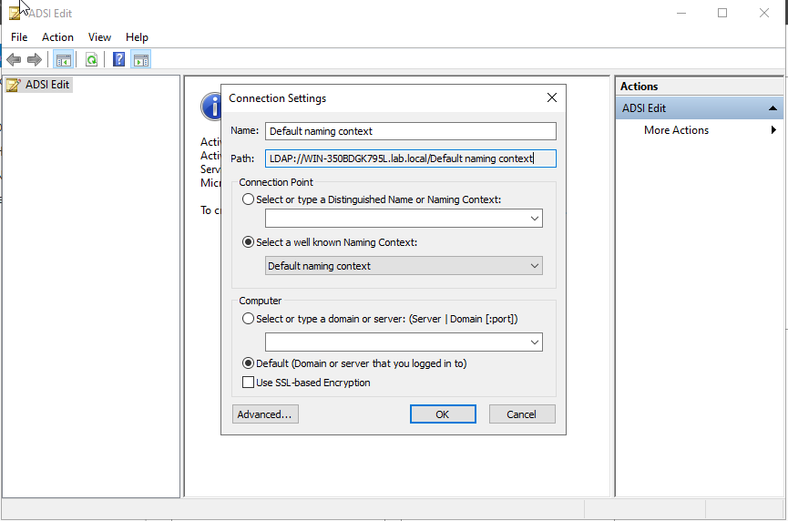    
It should look good since the lab domain is there and then click on OK to see this: 
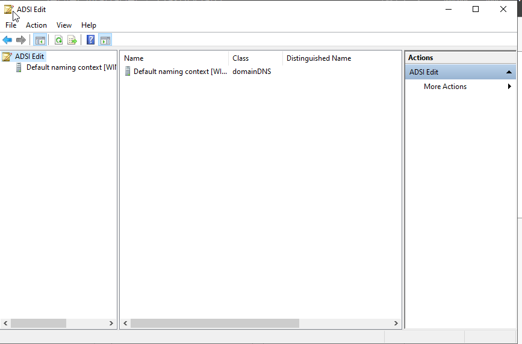   
After clicking on the Default naming contect, you should see DC=lab,DC=local, then CN=system:   
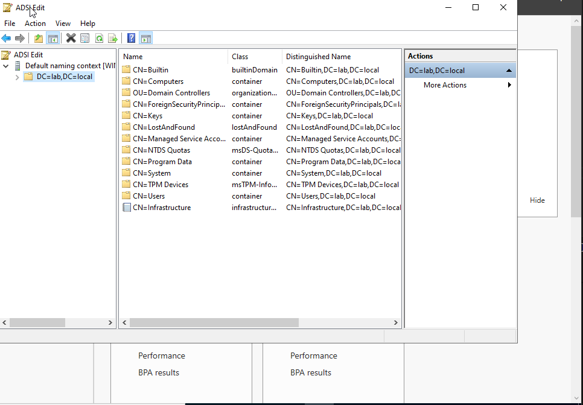   
Then right click on CN=System and select new -> object. 
After clicking on new, you will see a list of options, then scroll down till you see container and hit next.    
Then for value, name it System Management, hit next, then finish.   
Then hit refresh and right click on System Management since it will appear now. 
Then right click on it and go to properties and move to the Security tab.   
Click the advanced option you see and you will see this:    
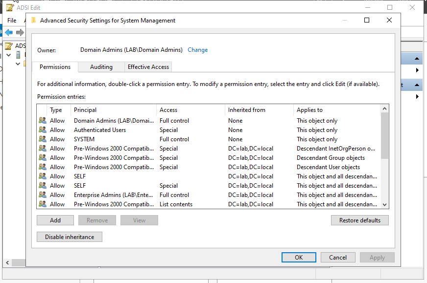    
Then click on Add and then select a principal. Then go to object types and select computers and it will show up.    
Then type SCCM$ and the computer should pop up like so: 
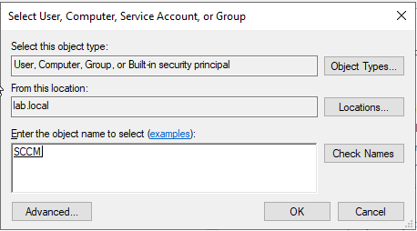  
After selecting ok, check full control and click OK 3 times and close out ADSI edit.    
Then in the SCCM01 VM, go and download the Windows 10 ADK and run it.   
Keep default settings, uncheck the gather insights and accept the license, choose only deployment tools and USMT and select install.   
After waiting for a few minutes, it should be done and hit close.   
Then go download the Windows PE ADK and install it. 
Make sure to so no to tracking and then wait for a few minutes. 
Then hit close. Then go and create a folder called Temp in the C:\ section. 
Then go and download a Visual C++ redistributable and after that go to the PowerShell as Admin like below
Then open PowerShell as Admin and run a command:   
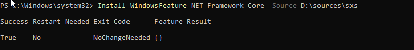    
Then go the SCCM iso folder and click on the Splash.hta file and hit open and you should see this:  
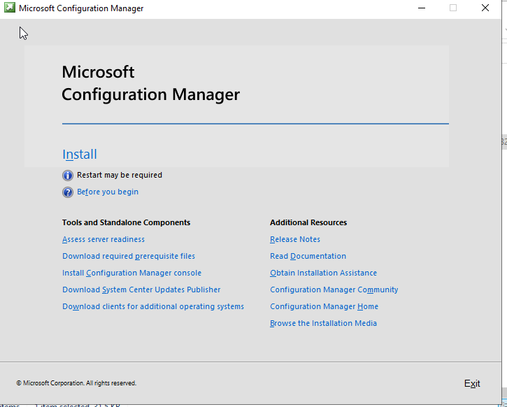   
Select install and then click on next and then you see this:    
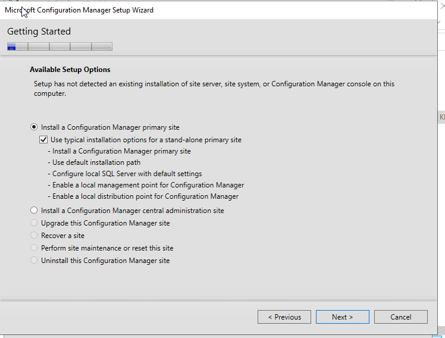 
Select the Use typical installation media option and hit next.  
For the product key, select the 180 day option. Then hit next and accept the license terms. 
Then when it comes to Download, select the path where the Temp folder was created and hit download and wait for a while.    
After waiting for a while this screen will pop up:  
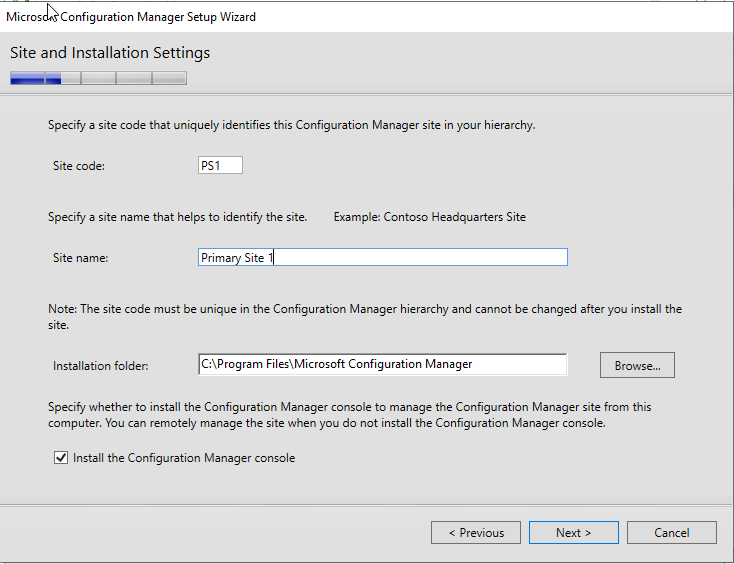   
Put in the requisite info from the image and hit next.  
Then keep on hitting next till you get to the prereqs, wait a second, then hit next.    
For the prereqs, you will have to install WSUS in Server Manager, Remote Differential Compression in features, delete a certain SQL connection that might pop up, change the SQL Server max memory to 8142 MB and install the Microsoft SQL Server 2012 Native Client. 
AFter fixing them up:   
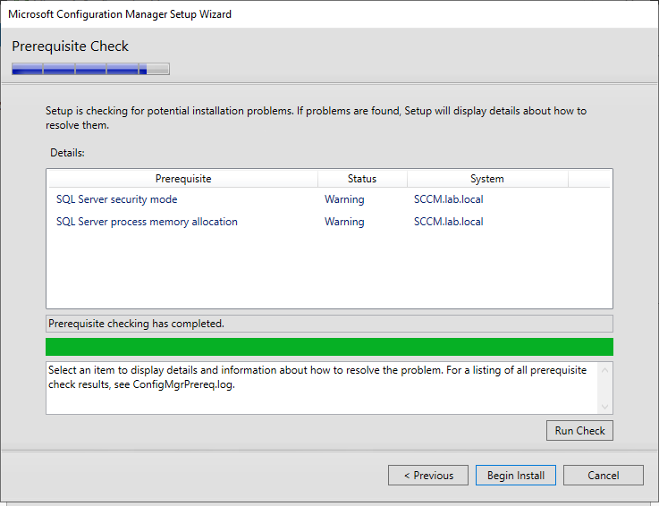  
Then hit install now and wait for a while. 
During this make sure to have to delete the excess database in SQL, should start as CM_, make sure that ODBC Driver 18 is set to 18.5.2 or similiar in 15, follow the path of C:\Program Files (x86)\Windows Kits\10\Assessment and Deployment Kit\Windows Preinstallation Environment and create a folder named x86 and copy the amd64 contents into it, inside the x86 folder in en-us, and rename the winpe.wim to boot.wim. Then go to C:\Program Files\Microsoft Configuration Manager\OSD\boot\i386 and copy the boot.wim file into it. Then go to task manager, to details, and close out any instances of msiexec.exe and then run ConsoleSetup.exe. Then it should have installed. 
Then you should see this:   
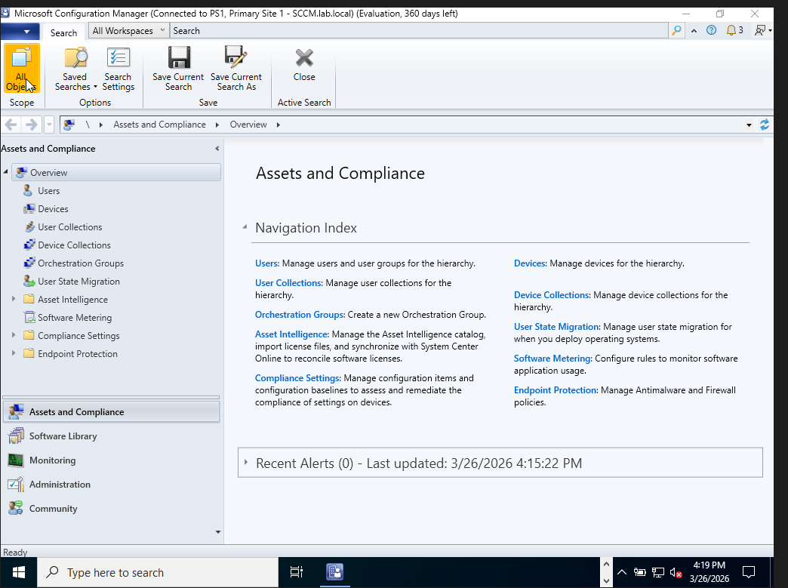    
Then go to Monitoring -> System Status -> Component status and see this:    
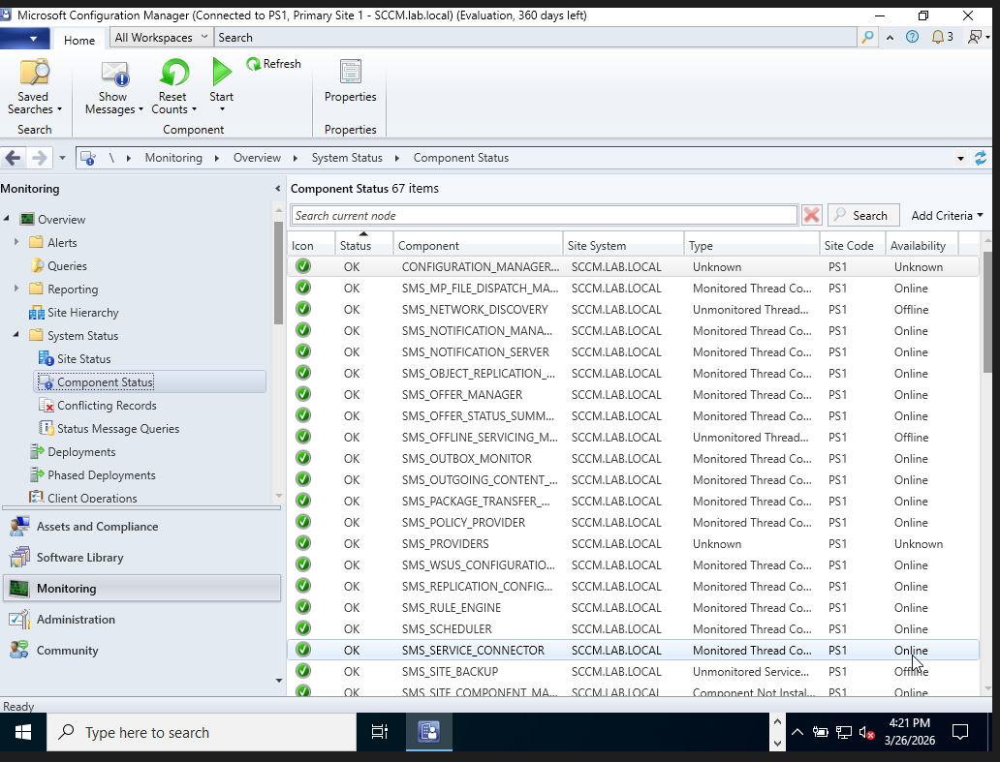   
Then go search SMS_SITE_COMPONENT_MANAGER and SMS_EXECUTIVE to see if they are green which they should be.  
Then go to Administration -> Site Configuration -> Servers and Site System Roles and check to see management point and distribution point roles are there which they should like below: 
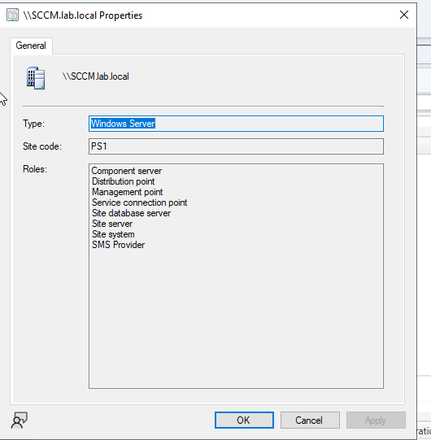   

# Setting up VM3
Memory: 4096 MB 
Video Memory: 128 MB    
Space: 60 GB    
Processors: 4   
Network: NAT Network set to SCCM Lab    
And a Windows 10 iso    
Then press start to get the VM up to install.   

After getting it up, should see that main screen:   
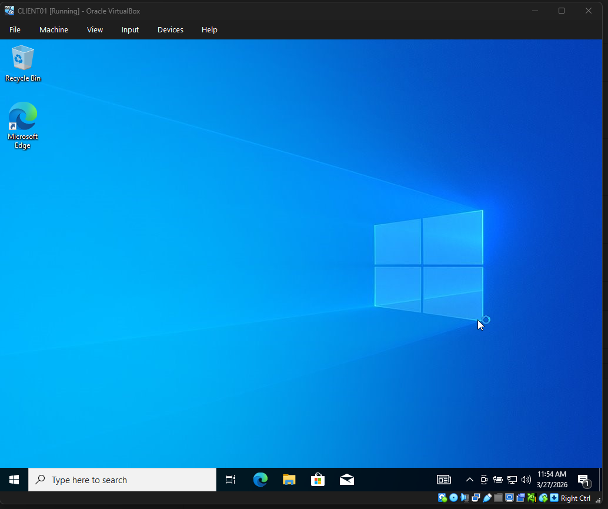  
Then right click start and go to network connections and click on change adapter options, then right click on Ethernet and choose properties and double click on IPv4 and select Obtain an IP Address Automatically.    
Set it up like this:    
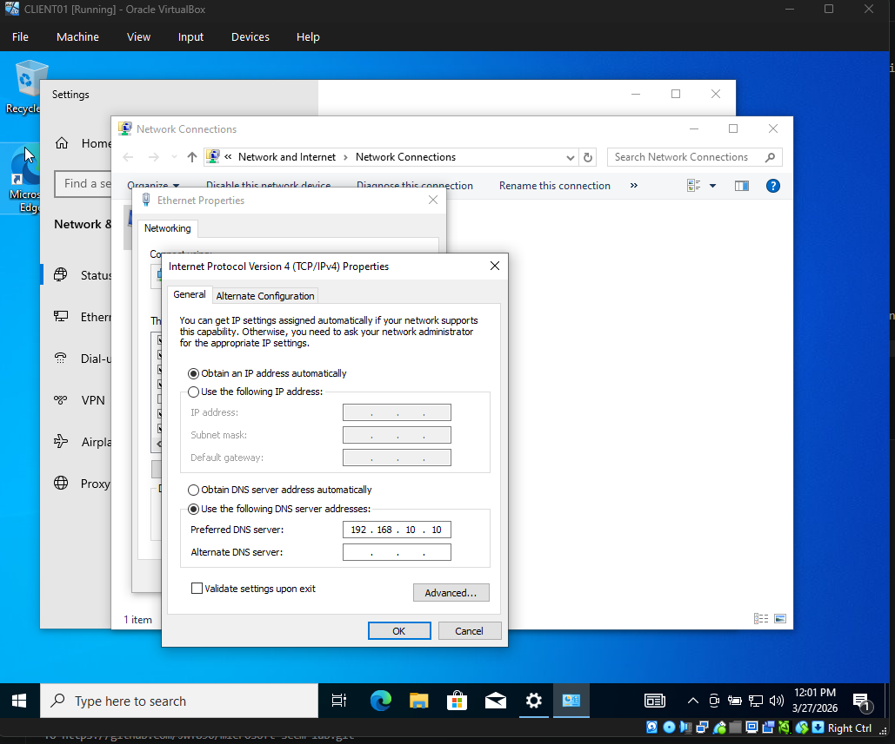 
Then click on OK a couple times and then go to the command prompt and type ipconfig /renew to get the IP and DNS.   
Then right click on start and go to system and click on rename this PC advanced. Then set the computer name to CLIENT01 and domain to lab.local.    
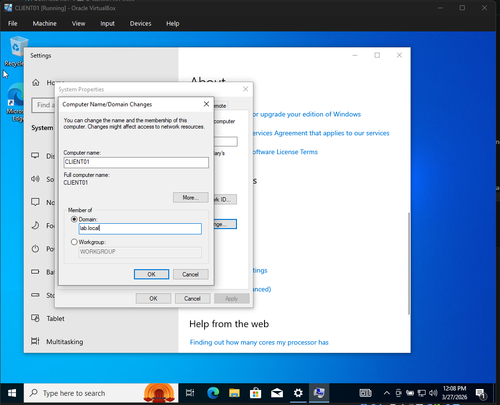  
Then click on and type the DC01 username and password to get it successfully domain joined. 
Then go and restart the computer. Then sign in as the sccm admin account and wait for it to pop up.    
Then go back to the second VM and continue to get SCCM fully set up.    

# SCCM Config Continued
Back in the SCCM VM, go the configuration manager console, go to admin -> hierachy config -> discovery methods, then right click on Active Directory System Discovery and enable Active Directory System Discovery. Then click on the star icon to add a new container. 
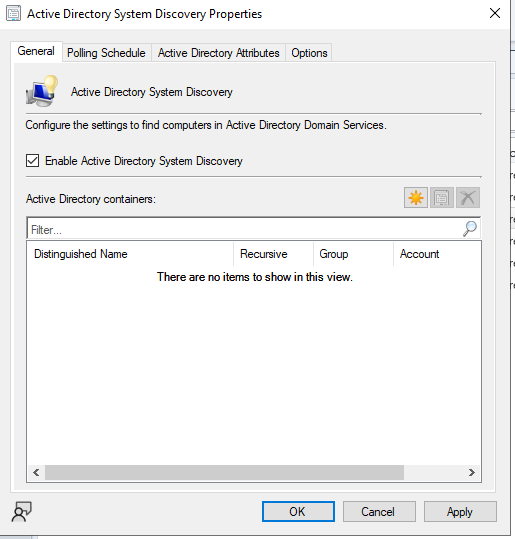    
Then you will see the option to browse, click on it and expand the lab.local and select computers, then click OK a couple times, then right click on System Discovery again and select run full discovery now and hit yes.  
Then go and do the same thing for the Active Directory User Discovery and Group Discovery respectively with users and groups.   
Then go to Boundaries and right click and choose Create Boundary like below:    
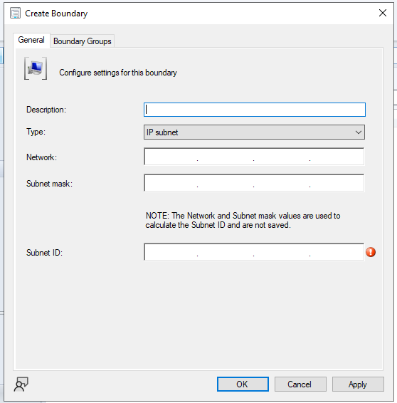 
Then for network type 192.168.10.0 and for subnet mask type 255.255.255.0 then click apply and OK.  
Then go to Boundary Groups and choose create Boundary Group and name it Lab Boundary Group and click add.   
Name it Lab Boundary Group and click on add and select the lab subnet, then go to references and check use this boundary for site assignment and click on add and select the lab.local option and click ok and ok once more to see it pop up like below:    
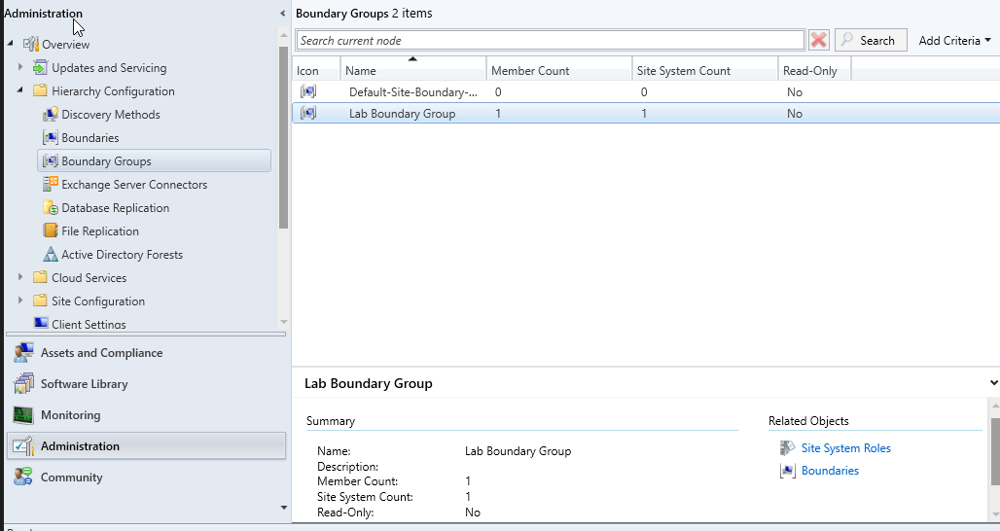  
Then its time to install SCCM Client on CLIENT01. Go assets and compliance -> devices and see this: 
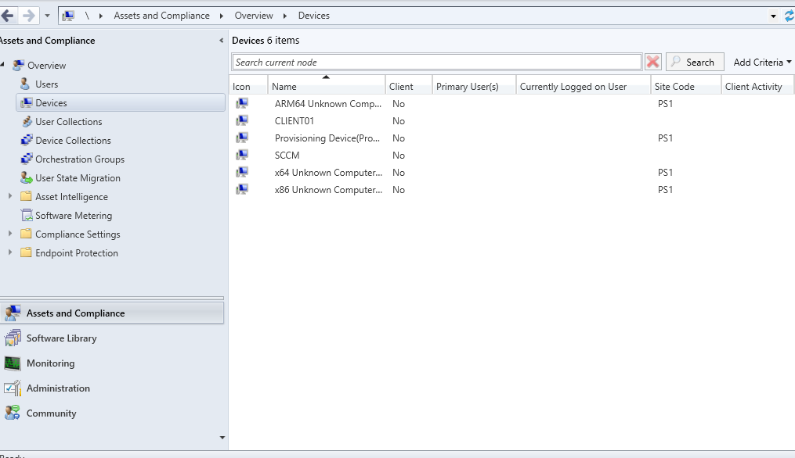    
Then right click on CLIENT01 and select Install Client and hit next and select the always install and site install buttons and hit next and once again
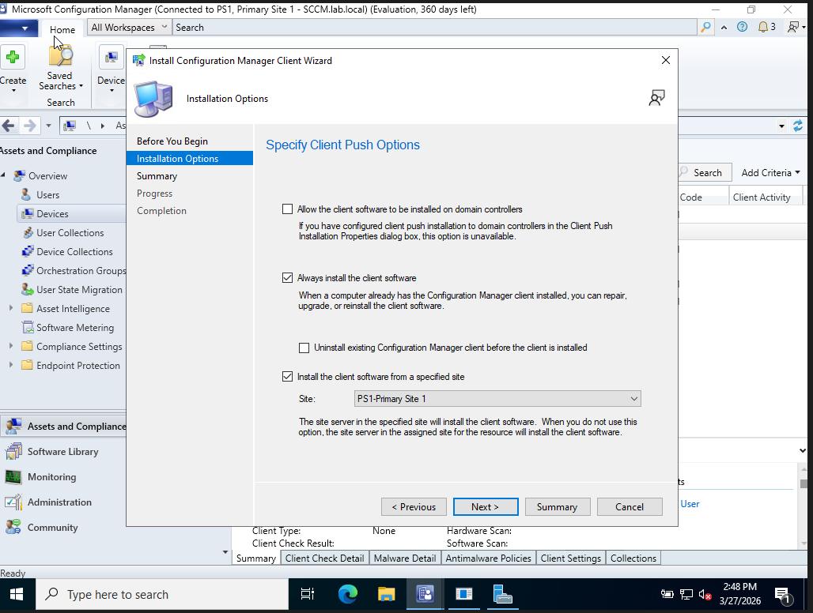  
Then it should take a couple seconds to install. Once done, hit close and go to the CLIENT01 VM and go to the Control Panel
Alernatively turn off both VM firewalls by running Set-NetFirewallProfile -Profile Domain,Public,Private -Enabled False, then ru
n in the SCCM01 conmand line dir \\CLIENT01\c$ which should show:   
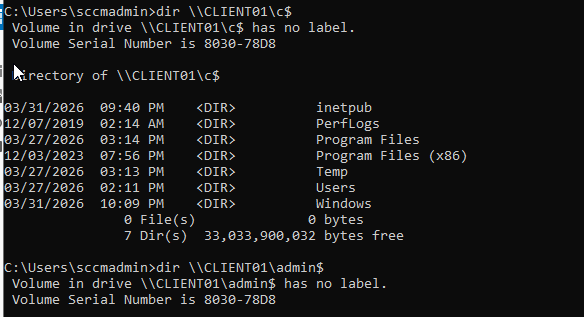  
Then in the Client VM run "\\SCCM01\C$\Program Files\Microsoft Configuration Manager\Client\ccmsetup.exe" SMSSITECODE=PS1 and hit enter and then wait for a couple seconds. When done type notepad C:\Windows\ccmsetup\Logs\ccmsetup.log to see this:   
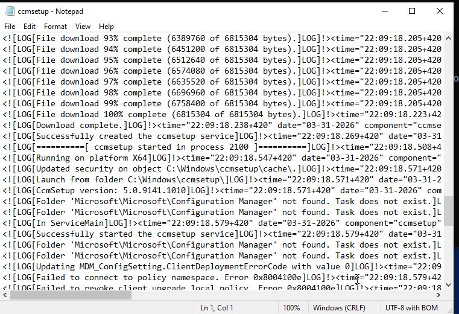  
Make sure to also in the DC01 VM to go to DNS Manager --> Forward Lookup Zones -> lab.local and right click on it and select New Host for A.    
Then right click on DC01, choose connect to DNS Server, then select the following computer and type DC01 then click OK. Then for SCCM01 click on New Host, name it SCCM01, FDQN should be SCCM01.lab.local, IP address should be 192.168.10.20, then click create associated PTR record and click on Add HOst, then ok, the done. Then in Client run, ipconfig /flushdns, noslookup SCCM01, ping SCCM01 and dir \\SCCM01\c$ which should work.  
Then in the command line in Client run: xcopy \\SCCM01\C$\"Program Files"\"Microsoft Configuration Manager"\Client C:\Temp\SCCMClient\ /E /I /Y. This should be the result: 
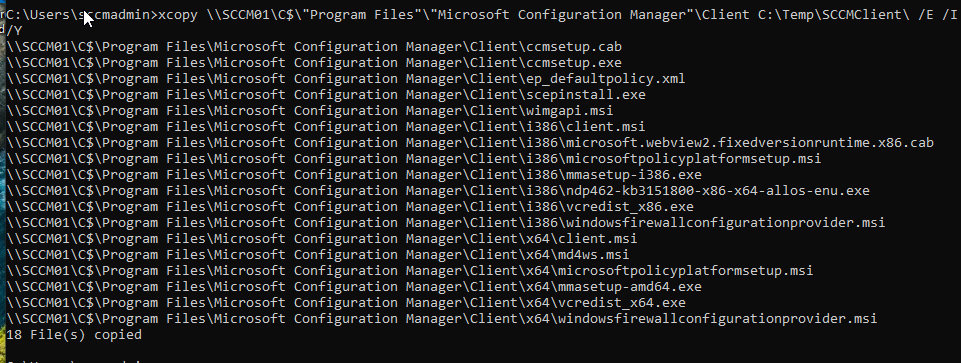    
Then run cd C:\Temp\SCCMClient to get into the correct directory and run ccmsetup.exe SMMSITECODE=PS1 and hit enter and wait for a few minutes.
After waiting for a few minutes you should see this:    
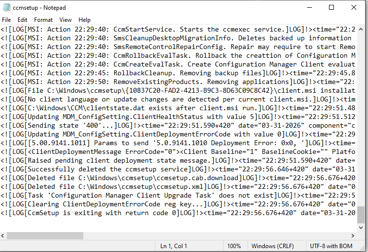   
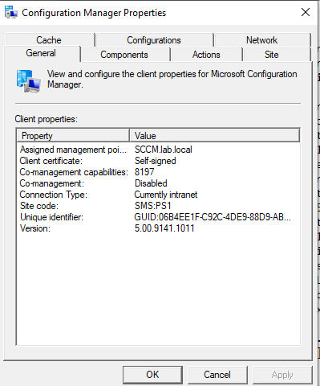    
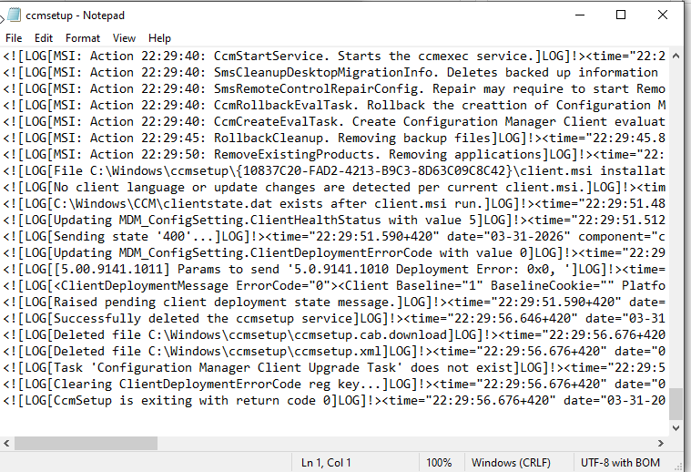  
Then go to Services.msc and check to see if SMS Agent Host is running:  

Then go to the SCCM VM and open up the Config Man Console -> Assets and Compliance -> and Devices and check to see if Client Activity is marked with a yes: 
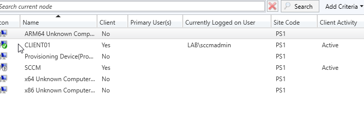  

Now its time to move to other steps/learning in this

# Device Collection

Pull up the Config Man Console and go to Assets and Compliance and right click on Device Collection. After that click on create device collection.  
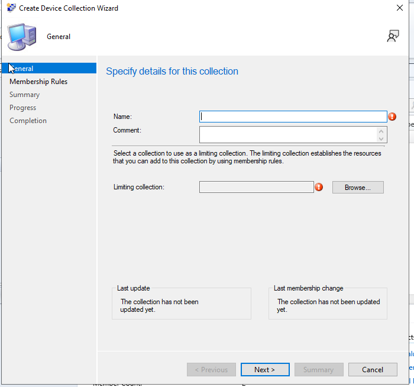 
Name it Windows 10 Workstations, for comment put All Windows 10 client computers and for limiting collection click on browse and select all systems and then hit next.  
Then you will see the membership rules screen:  
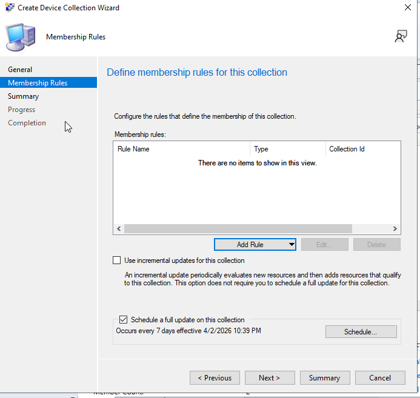    
Then click on add rule and choose query role. Name it All Windows 10 Devices and then click on Edit Query statement and see this:   
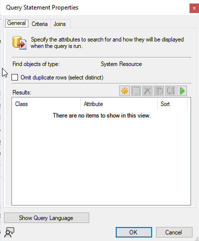    
Then replace the query with this:    select SMS_R_SYSTEM.ResourceID,SMS_R_SYSTEM.ResourceType,SMS_R_SYSTEM.Name,SMS_R_SYSTEM.SMSUniqueIdentifier,SMS_R_SYSTEM.ResourceDomainORWorkgroup,SMS_R_SYSTEM.Client from SMS_R_System where SMS_R_System.OperatingSystemNameandVersion like "%Workstation 10.0%". Then hit OK twice and check the option for using incremental updates for this and set the schedule to every 7 days or so then hit next to see summary and then hit next.  
Then wait a couple seconds for it to complete successfully and then hit close. Then wait a couple seconds and it should appear in the collection:   
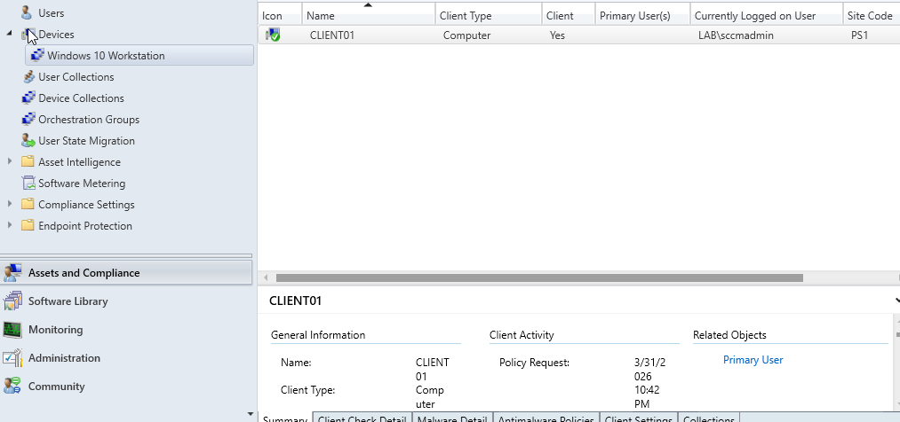    
Then go right click on Device Collections and create a new device collection for test lab computers. Name it Test Lab Computers and set the limiting collection to All Systems and hit next and for the rule choose direct rule and hit next and you should see this:   
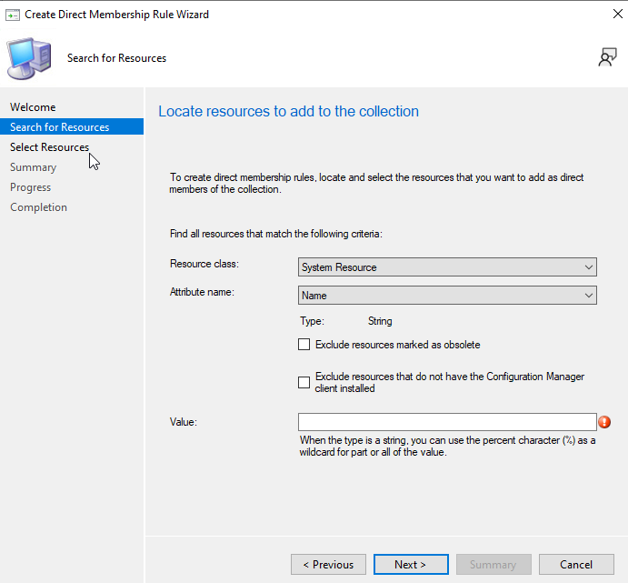  
In the value menu enter CLIENT01 and hit next and you see it:   
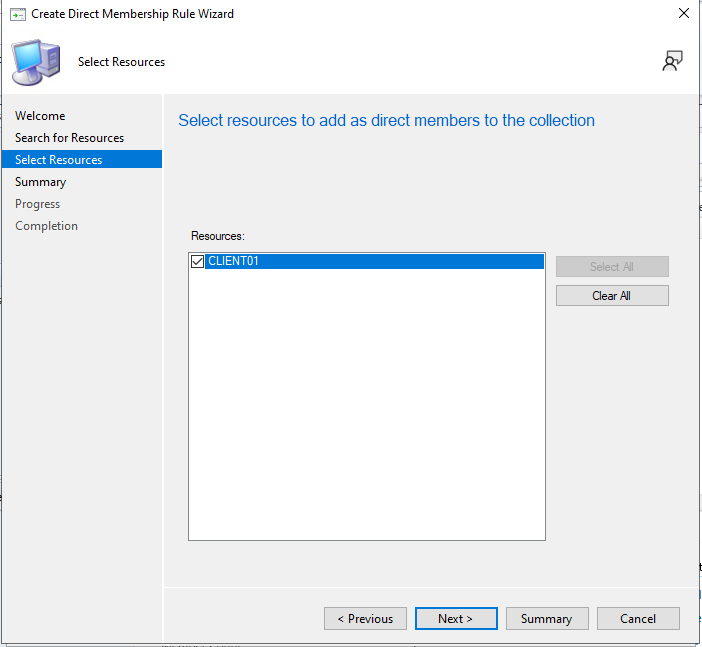  
Then hit next, then close, then hit next 2 times and then close.

# Test Application Package

Pull up Microsoft Edge and go download an application that can be installed such as Google Chrome and then go create a source folder for it in the SCCM VM by typing mkdir "C:\Sources\Applications\Google Chrome". Then copy or move the installer into it.    
Then go the Applications folder and right click on it to go to Properties -> Sharing then click on Advanced Sharing:    
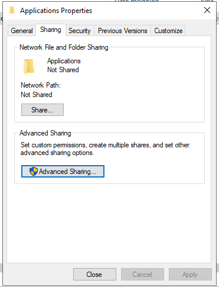  
Then click on Share this Folder and edit the share name to include $ after Applications and set permissions to everyone can read.   
Then click apply and ok. Then go to the Config Man Console and go to Software Library -> Application Management and then click on Applications and right click on it and select create application. 
After which this will pop up:   
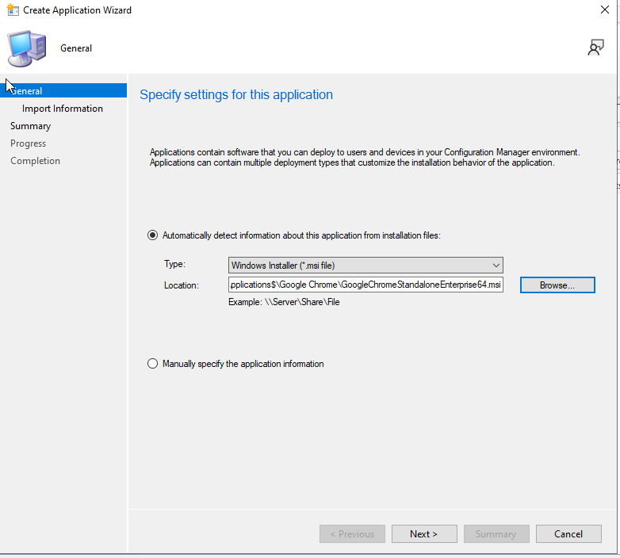  
Then right beside the browse button type: \\SCCM01\Applications$\Google ChromeStandaloneEnterprise64.msi and hit next.  
Or the better run so not to run into errors, go to PowerShell and run New-SmbShare -Name "Sources$" -Path "C:\Sources" -FullAccess "Everyone" and hit enter.    
Then select the manual option here: 
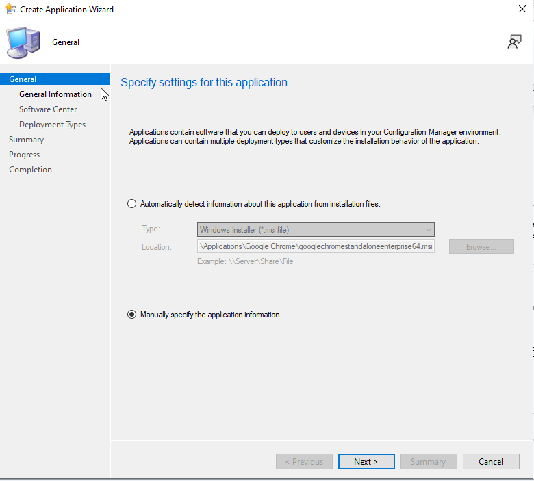  
Then hit next and see this: 
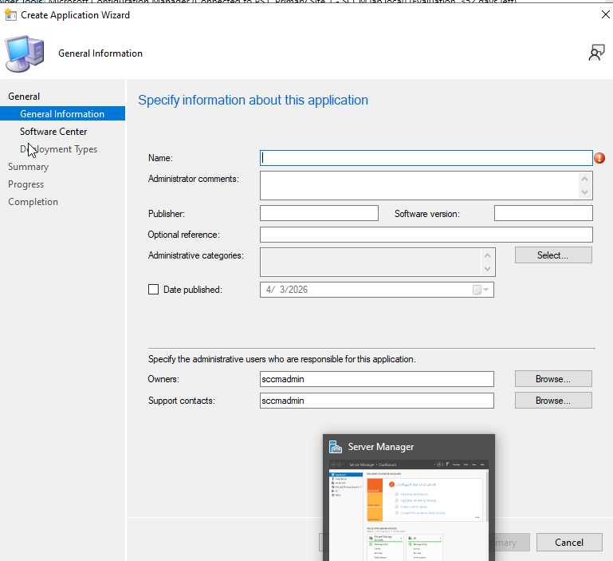  
Name it Google Chrome, publisher to Google LLC and software version to latest and hit next. 
Then hit next till deployment type and click on add.    
Select manual once again and hit next. For General info name it Google Chrome installer and hit next.   
Then you will reach this screen:    
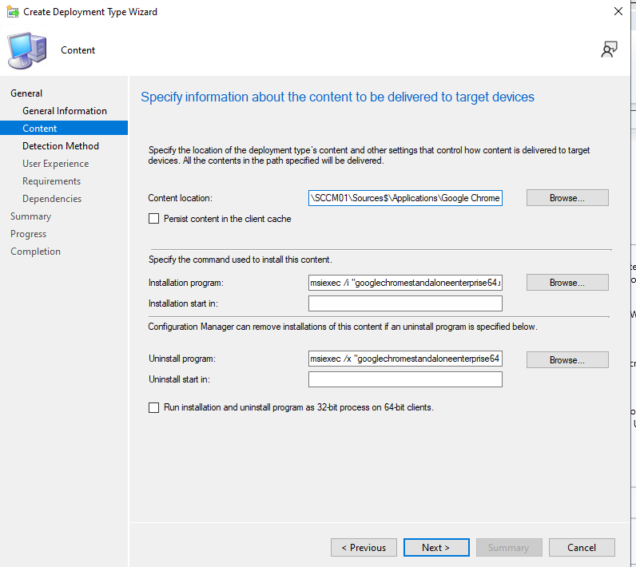    
For content location have it set to \\SCCM01\Sources$\Applications\Google Chrome since typing in C:\ path won't work. For the other two go to browse and choose the installer.  
Since its likely that the error will again go to PowerShell and type these commands:    
  
Then go to the command line and type rename "C:\Sources\Applications\Google Chrome" GoogleChrome after going to the Sources Folder and granting sccmadmin full control. Then the path \\SCCM01\Sources$\Applications\GoogleChrome should work.  
If it doesn't go to Software Library -> Application Management -> Packages and right click on it to create a package.   
    
Name it Google Chrome, description of Google Chrome Enterprise Browser, Manufacturer as Google LLC, English Language and latest version, check the package contains source folder and choose the folder its in and hit next.    
Click on Standard program and hit next. In Standard program name it Install Chrome for command line selct the msi file, run set to hidden and program set to whether or not the user is logged in and hit next. 
Then hit next until the completion is successfully done.    
Then it should appear in the packages screen like so:   
  
Then right click on Google Chrome and click on Deploy to see this:  
  
Click on Browse and choose Test Lab Computers selection and then hit next for the content page. Click on the add button and select distribution point and select SCCM01.lab.local, choose OK, then hit next.    
For deployment settings choose required and hit next. For scheduling, set the available time for a few minutes later in the day and expire for a few minutes afterwards and for assignment schedule select as soon as possible. Then hit next.  
Then hit next until the install screen. Then after a couple seconds:    
    
Then go to Config Manager in the Client VM. 
*While troubleshooting over the past few days, I found that there was an issue with the automatic deployment not going through to the Client VM. So I had to manually deploy the Chrome package. Can review the document I uploaded above. Will provide steps for how until can be fixed but the Claude doc is better at explaining*
First step is by noticing that the BitsTransfer 404 error, start by going to the DP first and using a correct path such as Invoke-WebRequest "http://192.168.10.20/SMS_DP_SMSPKG$/PS100006" -UseBasicRouting. Type http instead of https.   
Then type Start-BitsTransfer -Source "http://192.168.10.20/SMS_DP_SMSPKG$/PS100006.3/googlechromestandaloneenterprise64.msi" -Destination "C:\Windows\Temp\chrome.msi" -ProxyUsage NoProxy. Then type Get-ChildItem "C:\SCCMContentLib\PkgLib" | Where-Object Name -like "*PS100006*" 
Next step is to verify or change the assigned Management Point for the client. Type (Get-WmiObject -Namespace root\ccm -Class SMS_Authority).CurrentManagementPoint, then Resolve-DnsName SCCM01, then nslookup SCCM01. In the meantime, as a workaround, add a temp path by typing Add-Content "C:\Windows\System32\drivers\etc\hosts" "192.168.10.20 SCCM01 SCCM01.sccm.lab.local" or turn the DC VM. Then type Resolve-DnsName SCCM01 which should return SCCM01 IP. Then type Restart-Service CcmExec, then Start-Sleep -Seconds 30, then type (Get-WmiObject -Namespace root\ccm -Class SMS_Authority).CurrentManagementPoint. 
Next step is to check the CRL to see if its blocking content download. Start by typing Get-WmiOjbect -Namespace root\ccm\softmgmtagent -Class CacheInfoEx | Where-Object { $_.ContentID -like "*PS100006*" } | Select-Object ContentID, ContentVersion, Location, ContentSize. Then go to Administration -> Site Configuration -> Sites, right click on sites and go to Properties and go the Communications Security tab and uncheck the Clients check the CRL for site systems, then apply -> OK. Then restart and type Restart-Service CcmExec, then Start-Sleep -Seconds 30, then control smscfgrc and in Actions run Machine Policy Retrieval and Application Deployment Cycle with 30 second intervals
Here are some helpful commands for the steps:   
    
Current known issues are with EHTTP with the current workaround being to run Start-BitsTransfer -Source "http://sccm.lab.local/SMS_DP_SMSPKG$/PS100006.3/googlechromestandaloneenterprise64.msi" -Destination "C:\Windows\ccmcache\chrome.msi" -ProxyUsage NoProxy, then run msiexec /i "C:\Windows\ccmcache\chrome.msi" /qn and Chrome should appear afer a few seconds. Relevant logs to check on Client machine are PolicyAgent.log, execmgr.log, ContentTransferManager.log, CAS.log, and distmgr.log.  

# Intune Configuration and Integration
Another option to get applications is to get Intune configured with the system. First will need to sign up for a 90 trial with Intune.  
First go to this link: https://signup.microsoft.com/get-started/signup?offerid=71fe267c-1b50-4ac5-b278-28a2e4b6b7d1&ali=1&products=71fe267c-1b50-4ac5-b278-28a2e4b6b7d1&culture=en-us&country=us&bpr=1. Clicking on the link should get you in first step of the sign up portal where you enter your email. If personal is being used, after hitting next, you should see this screen:  
 
Then choose the set up account account and see this screen: 
    
Then enter in the required infomation needed and hit next.  
Then you will go the create an identity page with options for username, domain name, and password. Set the username to something like yournameadmin and for domain name enter in namelab and then enter in a strong password, then hit next.    
Then you will see a screen asking you to input your card info. This is mainly for verification purposes unless you want to buy something, set a reminder for about 85 days after signup to cancel your account. After inputting, you will need to input your phone number and sign up for MFA with the Microsoft Authenticator app to verify. After a few seconds a pop up screen will pop up with confirmation details and then click on get started option. Aftera a couple seconds, the admin center will pop up like so:    
    
Then next click on show all which will show admin center, then select on Microsoft Intune, which will show a new page with Devices on it. Then head to Device Onboarding and select on enrollment:  
  
Make sure its on Windows, then go over the CLIENT01 VM and go to settings and then accounts and find the option to access work or school account like so:   
    
Make sure to also have a second adapter set to NAT so the internet can be accessed. 
After getting second adapter up should see this:    
 
Enter in the credentials for Intune and should see this:    
  
Then click on done and go to the Devices -> All Devices and wait a few minutes. Before this, make sure to get the P2 trial which will enable auto enrollment. Go to users and select the admin user and enroll it into the Microsoft Entra ID P2 and hit save changes.  
Now in auto enrollmet should see this:  
    
Change the MDM user scope from none to all and hit save. Then go to the DC VM and go entra.microsoft.com and sign in with the credentials. Should see this: 
    
Then click on Connect Sync and scroll till you see Connect Sync Agent and click on it and accept terms and download and should be called AzureADConnect.    

# Hybrid Join
After clicking on it or right clicking, click on install, then a screen will pop up saying to agree to the terms and conditions, check it and continue, and then click on Express Settings. After a couple seconds, you will be prompted to enter the admin credentials for Entra ID.   
You might also run into this as well:   
    
Click on add and add https://aadcdn.msauth.net to the trusted sites and hit close. After which this will pop up:    
    
Enter in the on.microsoft.com credentials and hit next and enter in the password, after a couple seconds the Connecto to AD DS will pop up. 
  
Then enter in the DC credentials and see this:  
 
Then check the continue without matching all UPON suffixes and hit next.    
Then it will get to the review settings page, check the sync process when config complete and hit install and wait a while. 
After a few moments you might get this: 
    
The error most likely is corresponding with a expired certificate. Go to entra.microsoft.com -> Identity -> Applications -> App registrations and then click on all app applications and likely see this:   
   
Then go to Control Panel and get to Uninstall a Program and uninstall Microsoft Entra Connect Sync and then run this PowerShell command:    
Remove-Item "C:\Program Files\Microsoft Azure Active Directory Connect" -Recurse -Force -ErrorAction SilentlyContinue.  
Then restart the DC and run the freshly downloaded installer since it seems like the previous one is now outdated.  
Then go through the previous steps as before. 
If the errors persist, go and download the AADConnectProvisioningAgentSetup.exe and run it as administrator, then agree to the terms, hit install, then the Azure AD authentication prompt will appear and enter in the creds and hit sign in, then for service account select the gMSA option and type in the creds, then connect to Active Directory with lab.local and LAB\Administrator and the password and hit next and then configure which should finish successfully.  
Then in the Azure portal, go Microsoft Entra ID -> Entra Connect and go to Cloud Sync -> Agents and see this:   
  
Then go to configurations and select the option of AD to Microsoft Entra Connect and see this:  
    
Then hit create and wait a few seconds and have password hash sync enabled. Or wait until the overview page fully loads. After waiting a few minutes:   
  
Then click on review and enable and hit enable configuration and wait a few seconds.    
After a few seconds, go to provision on demand and see this:    
  
Then type in sccadmin and wait for it to sync.

After spending a few days troubleshooting, it appears that the Error that can be seen in the above image when configuring is tied to a UTC to Local Time error and should be fixed accordinally, along with moving the Entra install from the DC to SCCM for security purposes. 
TO fix the error with UTC to local time type in these commands: 
w32tm /config /manualpeerlist:"2.pool.ntp.org" /syncfromflags:manual /reliable:YES /update  
net stop w32time    
net start 32time    
w32tm resync /force 
Then go to app registrations and delete all applications that were registered before and then go back to the wizard and hit retry and see this: 
  
Then go to the Start Menu and look for Synchronization Services and click on it and see these results:  
  

For the setup, go the DC VM and go to the command line and type lodctr /R and then type winmgmt /resyncperf and then lodctr /R. Then type Add-ADGroupMember -Identify "Performance Monitor Users" -Members "pGMSA_153427cd$". THen type Get-ADServiceAccount -Filter 'Name -like "*"' | Select-Object Name, DistinguishedName. Then type Add-ADGroupMember -Identity "Performance Monitor Users" -Members "CN=provAgentgMSA,CN=Managed Service Accounts,DC=lab,DC=local". Then Install-ADSreviceAccount -Identify "CN=provAgentgMSA,CN=Managed Service Accounts,DC=lab,DC=local". THen type Get-ADComputer -Identity $env:COMPUTERNAME -Properties *ServiceAccount* | Select-Object Name, msDS-HostServiceAccountBLS. Then type Set-ADServiceAccount -Identity "CN=provAgentgMSA,CN=Managed Service Accounts,DC=lab,DC=local" -PrincipalsAllowedtoRetrieveManagedPassword "WIN-350BDGK795L$".   
Then type Get-ADServiceAccount -Filter "Name -like '*prov*'" | Select-Object Name, DistinguishedName. THen type Add-KdsRootKey -EffectiveTime ((Get-Date).AddHours(-10)). Then type New-ADServiceAccount -Name "provAgentgMSA" -DNSHostName "provAgentgMSA.lab.local" -PrincipalsAllowedtoRetrieveManagePassword "SCCM$". Then type Get-ADServiceAccount -Identity "provAgentgMSA". 
Then on the SCCM VM, type Install-WindowsFeature RSAT-AD-PowerShell, then type Import-Module ActiveDirectory, then type Install-ADServiceAccount -Identity "provAgentgMSA", then type Test-ADServiceAccount -Identity "provAgentgMSA".  
Then test port connection on SCCM by typing Test-NetConnection -Port 443 and 80 respectively and see that it can connect.   
Back in the DC VM create a test user account with the @jonlab2026.onmicrosoft.com domain and click OK. Then add the test user and other users to a OU named Entry_Sync_Users and move them into there. Then in in New Configuration in Entra, have the option set to Scope by OU and with the DN name of it as OU=Entra_Sync_Users,DC=lab,DC=local. Then after following the above steps of getting rid of the contents of the folder and time sync, click on configure or retry and it should go through in Users in Entra:    
    

Then its time to get the Client VM properly enrolled in MDM since it will say none. In the DC VM, go to Group Policy Management and expand the lab.local forest and right click on lab.local and and click on the option of Create a GPO and like so:   
    
Name the GPO Intune-Auto-Enrollment, then hit refresh and it should pop up, then click on Link an Existing GPO and choose the Intune-Auto-Enrollment one and click apply and OK.    
Then right click on the new policy and click on edit and go to Computer Configuration -> Policies -> Administrative Templates -> Windows Components -> MDM and should see the policy of Enabling automatic enrollment using default creds and click on enable, then options and then for select credential type set it to user credential and hit apply then ok. Then afterwards, move the Client VM into the Managed_Workstations OU after creating it. Then right click on the Managed_Workstations OU and click on Link Enabled and set it to yes.   
Then go to the Client VM and run the command gpupdate /force, then run gpresult /r /scope computer to confirm it is there like so:  
   
Then go to the SCCM VM and open Task Scheduler and follow the path to EnterpriseMgmt:   
  
Then type Start-ADSyncSyncCycle -PolicyType Delta, then Import-Module ADSync, then Start-ADSyncSyncCycle -PolicyType Delta. Then open the Synch Service for successful runs.    
First in the DCM VM go to the SCCM Admin user after going to ADUC and clicking on View -> Advanced Features -> Advanced and click the user properties -> Security -> Advanced and then click on Enable Inheritance and enable write permission, then run Start-ADSyncSyncCycle -PolicyType Delta.   
Then on the DC VM, go to ADUC and go to the properties of SCCM Admin and remove it from the Domain Admins group, then run Start-ADSyncSyncCycle -PolicyType Initial. Then go to ADUC for SCCM Admin and go to Attribute Editor and for adminCount change it from 1 to 0. Then make sure to grant full rights to the MSOL_ accounts that are there. Then run Start-ADSyncSyncCycle -PolicyType Delta. Running in Sync Service should get the success that is needed. Then in the SCCM VM run the command Set-TimeZone -Name "Central Standard Time" which sould reset it.    
Then go to the Azure AD Connect and select configure -> Configure Device Options, then hit next, then you will see some options for joining but click on Configure Hybrid Azure AD join -> Device Operating Systems and click on Windows 10 or later is checked, then on the SCP configuration, ensure that forest lab.local is selected, then for authenticated service is selected as Microsoft Entra ID, then click on Add and enter the lab.local Admin creds and configure and exit.   
Next up is configuring the exact UTC time between DC and Client. ON the DC, type w32tm /config /manualpeerlist:"0.pool.ntp.org 1.pool.ntp.org" /syncfromflags:manual /reliable:yes /update, then Restart-Service w32time, then w32tm /resync, then [System.DateTime]::UtcNow which should get the UTC time. Then in the Client VM type dsregcmd /leave, then dsregcmd /join /debug with this result:    
    
    
Then its time to go and get ISUserADJoined set to Yes, AzureADPort set to Yes, and for MDMUrl to have something.    
Go to the Microsoft 365 Admin center and go to active users in users and find the SCCM Admin user, and test user, gave them these licenses: 
    
Then hit save and go to the Client VM and type gpupdate /force. Then sign out and go to the SCCM VM and type Get-ADUser sccmadmin -Properties UserPrincipalName | Select UserPrincipalName, then type Set-ADUser sccmadmin -UserPrincipalName "sccmadmin@jonlab2026.onmicrosof.com", then type Set-AdAccountPassword -Identity sccmadmin -Reset -NewPassword (ConvertTo-SecureString "Password here" -AsPlainText -Force), then type Unlock-ADAccount -Identity sccmadmin.  
Then go search for the Sync Service and open it and click on connectors, select lab.local and run a delta sync and hit OK, wait for a success message, then go to jonlab2026.onmicrosoft.com, hit run, then delta sync, then OK. After waiting a few minutes, head back over to the Client VM and see this: 
  
Then run dsregcmd /status and see if MDMUrl, AzureADPrt and IsUserAzureAD changed like so:  
    
    
    
Looking over it appears that the ones mentioned have changed to Yes and or have a link now. Then its time to work on getting MDM changed from None. 
Go Device Enrollment Manageer in Intune Admin Center, click on add and type sccmadmin@jonlab.microsoft.com and click on add. Then in Client VM go to Settings -> Accounts -> Access work or school, if it pops up with no priveleges, then go to Entra or Azure AD and click on Users for sccm admin and click on assigned roles, then click on add assignment for select Intune administrator and click on add like so:    
  
Then click on next and assign and set the parameters to this like below:    
 
Then click on assign and wait for a few seconds for it to appear in assigned roles. 
In the DC VM, go to Group Policy and make sure the following settings are correct for the GPOs: 
    
Then in the SCCM VM, go the SCCM Console -> Administration -> Cloud Services -> Cloud Attach and see this:  
    
It will be blank at first so right click on cloud attach and see the setup screen with a sign in option. Sign in with the main admin global account, but before that in the Client VM go to regedit as admin and go to the following:   
    
And delete the keys that aren't Status, Ownership, or Context. Then go back to the SCCM one and see this:   
    
Click on sign in and afterwards, press on next and see this after a few seconds:    
  
Then you should see the CoManagement cloud attach item from the picture.
Then go to the Client VM and run & "$env:SystemRoot\system32\DeviceEnroller.exe" /c /AutoEnrollMDM. 
Then go to the Intune center and see this in Windows Devices:   
  
To change MDM authority go to this link: https://intune.microsoft.com/#view/Microsoft_Intune_Enrollment/ChooseMDMAuthorityBlade. Which should allow for change with MDM authority from this picture:    
    
Then go the Client VM and go to Services.msc and sign in as administrator for it. Then scroll down till you see SMS Agent Host and stop it, then hit refresh on top and get SMS Agent Host running again. Then to make sure it worked go to Local Disk -> Windows -> CCM and open up CMTrace and open up CoManagementHandler.log and check to see if the device provisioned or not: 
    
Then go to Devicesin Entra ID and Intune Center to check for status:    
  
    

# Return to Test Application Package
Now that everything is configured with Intune, lets install a app from Intune. To install a app from Intune go Apps -> Windows -> Create and select on App type like so:    
    
Then search up something like Brave and choose select and see this: 
    
Then hit next and you will see this:    
  
Lets do the Group mode and hit next and review, then hit create. At the same time go to the SCCM Server and go to the Config Manager and go to Cloud Attach in Admin -> Cloud Services -> Cloud Attach and click on properties and go to workloads like so: 
  
Move the Client apps from Config Manager to Intune all the way then apply then ok.  
Then go back to Intune and do something like Spotify to test it out and when configuring do for enrolled devices in the MDMUsers group and save it. Then go to Task Scheduler and find run the Schedule #3 sync ones like so:   
    
Run both and then wait for a few minutes for it to pop up in the Company portal like so:    
  
Then click on install and wait for a few minutes. After a few minutes:  
   
Then you will see Spotify in the start menu and click on it to make sure you can access it like so: 
  

# Windows Updates Deployment
Next is to do Windows update deployment, go the SCCM Server and make sure that WSUS is installed, then open Config Manager and go to Administration -> Site Configuration -> Servers and Site system roles. Then right click on the site and choose the option of Add Site System Roles and click next until here:  
    
Select Software Update Point and hit next and keep the ports of 8530 and 8531 the same. Then click next until getting to Sync Source and select Sync from Microsoft Update. 
Then in Sync Schedule, enable the sync on a schedule and set a schedule of a day or so. Then hit next and keep supersedence the same. Then in WSUS Maintenance check them all. Then keep the run times the same, hit next and for update files select the option of Download updates for approved updates. Then hit next and get to the classifications screen: 
    
Select the options of Critical Updates, Security Updates, and Definition Updates. Then hit next and go to products and expand the options till you see Windows 10 and Windows Defender and select both. Then hit next and make sure language is correct. Then go to the Summary and confirm:    
    
Then hit next and wait for a few minutes:   
  
Then go back to Config manager and go to Software Library -> Software Updates -> All Software Updates:  
[Sync](./images/sync.png)   
Then click on sync software settings and select on Yes. Then go to C:\Program Files\Microsoft Configuration Manager\Logs and scroll down to the wsyncmgr.log and go to the bottom of the log:   
    
Then go wait for a while before the next step. If it comes up with something like this: 
  
Then go back and review the correct settings, then go check wcm.log and check for errors, if so go about doing this:    
winmgmt /verifyrepository to verify if its there which it should be, if not run /salvagerepository  
Then run Get-Service winmgmt | Select Status, StartType to see the running status  
Then run netsh advfirewall firewall set rule group="Windows Management Instrumentation (WMI)" new enable=yes.   
Then run Stop-Service winmgmt -Force and Start-Service winmgmt and Restart-Service SMS_EXECUTIVE. Then run: 
$svc = Get-WmiObject Win32_Service -Filter "Name='SMS_EXECUTIVE'"   
$svc.StopService()  
Start-Sleep -Seconds 10 
Start-Service SMS_EXECUTIVE and check wcm.log:  
    
Then get SMS_EXECUTIVE back up fully by running:    
Start-Service -Name "SMS_EXECUTIVE" -Verbose    
Get-Service SMS_EXECUTIVE | Select Status, StartType    
sc.exe start SMS_EXECUTIVE  
Then run Get-Service SMS_EXECUTIVE | Select Status to see it running again
Then go back to Software Library -> Software Updates -> All Software Updates and right click on Sync Software Updates and get wsyncmgr.log back up and watch it for updates and wait for a while. Something to keep in mind was that Windows 10 EOS was last year so lets skip this for later.

# Task Sequence
Go to Software Library -> Operating Systems -> Task Sequences   
But before doing so, lets go download 7-zip by going to https://www.7-zip.org/download.html and download 7zip. Then to to C:\Sources\Applications and create a 7zip folder and put the installer into it.   
Then in task sequence right click in the screen and click on create application and see this:   
  
Select on Create a new custom and hit next and name the Task sequence Installing Application and the description of Installs 7zip like below:   
    
Then click on next and confirm the settings and wait a couple seconds for it to be done and hit close.  
Then right click on it and click on edit and see this:  
  
Then click on add dropdown and select dropdown Software -> and select on Install Application and see this:  

Then go to Applications in Software Library and create a new application with the 7zip msi and do it like this: 
  
*Make sure to add /Sources/*    
And finish creating it and right click through the rest.    
    
Then right click on 7zip and select the Distribution point of SCCM.lab.local and finish it. 
Then go back to task sequence and click on edit and add software like before and click on the star button like below:   
  
Click on Ok and add another step to restart the computer liek so:   
    
Then add another sequence for running command line and name it Verify 7zip like so: 
    
The command the photo is what should be used, then click on options and click on continue on error. Then hit OK.    
Then right click and hit deploy and see this:   
    
Click on browse for selection and choose the test lab computers and hit oK and hit next and go to deployment settings and have the purpose be available, leave scheduling as default and hit next and for user experience enable Show Task Sequence progress and hit next. Keep alerts and distro points as default and hit next on summary to install which should complete successfully and hit close.    
Then go to Assets and Compliance -> Device Collections -> Test Lab Computers and verify Client VM is there. 
Then to make sure everything is working on Client VM run the following: 
Invoke-WMIMethod -Namespace root\ccm -Class SMS_CLIENT -Name TriggerSchedule "{00000000-0000-0000-0000-000000000021}"   
Invoke-WMIMethod -Namespace root\ccm -Class SMS_CLIENT -Name TriggerSchedule "{00000000-0000-0000-0000-000000000121}"   
Then go check on Client VM the following logs: PolicyAgent.log, CAS.log, execmgr.log. Also make sure to right click on installing application to set distro point to SCCM.lab.local.    
Log Result: 
    
    
  
Then on the client run Get-WmiObject -Namespace root\ccm -Class SMS_Authority to check connectivity and Get-WmiObject -Namespace root\ccm -Class SMS_MPPProxyInformation to check right pointing or not.    
Then on Client run $mp = "SCCM.lab.local". Then run Invoke-WebRequest -Uri "http://$mp/sms_mp/.sms_aut?mplist" -UseBasicParsing and the SMSAuthority one again along with pinging SCCM.lab.local and nslookup to verify.    
  
the 500 error means that there is a 500 Internal Server Error so verify doing this on SCCM server: 
Get-Service W3SCV | Select Status   
Start-Service W3SVC 
Then run Import-Module WebAdministration and then Get-WebApplication | Where-Object {$_.path - like "*sms_mp*"}
THen go check Monitoring -> Site Status -> Component Status for SMS_MP_CONTROL_MANAGER. Then go check mpcontrol.log 
Result: 
 
    
   
To fix run on SCCM, Import-Module WebAdministration. Then run Restart-WebAppPool "SMS Management Point Pool". Then run Restart-WebAppPool "SMS Windows Auth Management Point Pool", then run iisreset /restart. Then wait 2 minutes and run Invoke-WebRequest -Uri "http://SCCM.lab.local/sms_mp/.sms_aut?mplist" -UseBasicParsing and see this:    
   
Then go to Client and run:  
Invoke-WMIMethod -Namespace root\ccm -Class SMS_CLIENT -Name TriggerSchedule "{00000000-0000-0000-0000-000000000021}"   
Invoke-WMIMethod -Namespace root\ccm -Class SMS_CLIENT -Name TriggerSchedule "{00000000-0000-0000-0000-000000000121}"  
Then wait for around 5 minutes and go Software Center - Operating Systems and see this: 
 
Then click on it and click on the install screen:   
    
*Good markdown and docx guides for solving a good bit of issues that have popped up in the task sequence part*
To verify it worked type this:  
  
Then go open the application:   
    
Next its time to move on to Report generation

# Report Creation & Compliance Settings
Start by verifying if SSRS is installed or not and see if its installed or not and verify health by running these commands: 
    
It shows that we need to install SSRS, start by going to https://www.microsoft.com/en-us/download/details.aspx?id=55252 and see this:   
  
And clicking on download and download it.   
After downloading, right click on it and run it as administrator and see this screen:   
  
Click on it and select the free edition and hit next till the install portion and wait a couple seconds and see this:   
    
Then click on Configure Report Server and see this: 
  
Hit connect and it will go to the normal screen and head to service account and verify for correctness and then head to Web Service URL like so:    
    
Then take note of the link for later since it will be needed. Then hit apply and wait a second before moving on and see this:   
  
Then click on change database and see this screen:  
    
Choose the create a new report server database then hit next, then for the next screen have SQL Server as SCCM or localhost and have authentication as Current User and hit next, on the database screen name the database ReportServer and hit next and go to database and leave it as is and hit next and go to summary which should look like this:  
  
Then hit next and wait for a few seconds. After waiting for a few seconds, it will be done and able to click finish and see that its successful:    
  
After clicking on finish it should say finished successfully. Then go to Web Service URL and see this:  
    
Leave as is and click apply, if its greyed out go to Web Portal URL and click on apply. Then go back to Web Portal URL and click on the link and it will take to the site which should look like this:  
    
Then go to Config Manager and go to Administration -> Site Configuration -> Servers and Site System Roles and right click on SCCM and click on add Site System Roles and go to System Role Selection and click on Reporting Services Point and hit next and go to the specify reporting services settings like so:  
  
First verify database server name and then for username, choose existing and select the Administrator account, click ok and hit next to summary and verify and hit next for it to configure. After it gets done use CMTrace to view the log srsrp.log in C:\Program Files\Microsoft Configuration Manager\Logs\srsrp.log and watch for any success messages.    
After a few minutes should start seeing logs like this: 
 
With earlier messages having created a folder called ConfigMgr_PS1
 
These 2 are a couple examples of logs of setup. Wait a while until it stops. After waiting a while: 
  
The shutdown for 1 minute log means that it is done. Then run this command to see how many reports were created:    
    
Then go to http://SCCM:80/Reports and select ConfigMgr_PS1 that was created in the logs to verify and see this: 
    
It shows 60 folders and 2 data sources and clicking on one of the folders shows more sub folders like so:   
    

With the SCCM site done, its time to do a Intune side of it, go to https://intune.microsoft.com and go to Reports -> Device Management -> Device Compliance. Then to compare and go to ConfigMgr_PS1 -> Compliance and Settings Management -> Summary compliance by configuration policies with both looking like this: 
  
  

First lets do SCCM side of it. Go to Config Manager -> Assets and Compliance -> Configuration Items and right click and select the option of create configuration item and this screen will pop up: 
    
Name it Lab - Firewall Check with type of Windows Desktops and Servers, then hit next and go to supported platforms and uncheck everything that isn't Windows 10 or Windows Server and hit next and go to settings and click on new and see this:   
  
Name it Firewall - Domain Profile, setting type to Script, Data type to Boolean and click on add script and add this script:    
  
Then click on Ok for it to save and go away and click on Compliance Rules tab and click on new and see this screen: 

Name it Firewall Domain Profile Must Be Enabled, rule type to Value, operator to equals, value to true and noncompliance severity to Warning. Then click on OK twice and hit next till getting to summary to verify and wait for a few seconds and it should be done and visible in Configuration Items.    
Then go to Configuration Baseline and right click on create configuration baseline and see this screen: 
  
Name it Lab - Security Baseline, then click on add -> Configuration Items and choose the Lab - Firewall Check that is available with the original presets, click on OK, and click on the option to enable the option of always apply this baseline even for co-managed clients. 

Now its time to deploy the created baseline, start by right clicking on Lab - Security Baseline like so:    
  
And clicking on Deploy and see this screen: 
  
Make sure the selected baseline is there, then check Remediate noncompliant rules when supported and have a simple schedule of 1 day, and for collection select the dropdown and change it from user collection to device collection and select all systems or just Windows 10 Workstation and hit OK.  
Then go to the Client VM and go to Control Panel -> Configuration Manager - Actions and run the Machine Policy Retrieval & Evaluation Cycle and Application Deployment Evaluation Cycle ones, then wait a few moments for the policy to appear like so: 
  
Then click on evaluate for the baseline and after a couple seconds the report will appear. Now running this the first time pops with this:  

The error code says the SCCM client execution policy requires signed scripts. For a fast fix, run this in powershell:   
  
Then go back to Configuration Manager properties, click evaluate and likely run into the same error again, then go to Powershell and run this:  
  
Then run this set of commands:  
  
Then go back to Configuration Manager in Client and rerun the evaluate option and see that the status has changed and a new report has been created:    
    
This shows that it worked. Now go back to the SCCM VM and go the website created earlier of http://SCCM:80/Reports and go to ConfigMgr_PS1 -> Compliance and Settings Management -> Summary compliance by configuration baseline and wait for a little bit for the report to appear.    
After waiting about 20 minutes and and select the View Report option or refresh and see this:   
    
Then click on the 1 for non-compliant and see this: 
    
Then click on CLIENT01 and see this screen: 
    
    
With the SCCM side of reporting and compliance done, time to do Intune side.    

For Intune go to Reports -> Device Management -> Device Compliance and click on the generate option and wait a couple seconds. Then after a couple seconds the report will be generated like so:    
    
    
This shows the Client VM is compliant and managed by SCCM in a co-management environment. Now to create a Intune Compliancy policy will require changing the workload to Intune.    
Go to SCCM console -> Administration -> Cloud Services -> Cloud Attach and right click on the property to change the setting:   
  
Then hit apply and ok for the change to take affect.    
Then go to Endpoint Security -> Device Compliance -> Policies -> Create Policy which will look like this:   
    
For platform choose Windows 10 and later and a profile of Windows 10 compliance policy, then click create which should pop up with this:    
    
For the first screen, name it Lab - Firewall Policy with a description of Mirrors SCCM firewall check - requires domain firewall profile enabled. Then hit next for the compliance settings screen: 
    
Expand the System Security dropdown and scroll down till you see Firewall option and make it required like so:  
  
Then hit next and move on to the Actions for non-compliance screen: 
    
Leave as is and move on to assignments like so: 
    
Select the option of All Devices so it can get the Client VM and hit next to the review page and hit create and see this:   
    
Then go to the Client VM and run the following: 
 
Then refresh the page and see this in Intune:   
    
Screen shows that it is non-compliant. To resolve go to PowerShell and run: 
  
With the enabled as true go to the Config Manager in Control panel and find the Security Baseline and click evalutate on it which should make it compliant like so: 
   
Then wait for a little bit for it to update in the report manager and should say compliant: 
  
Intune will likely stay as non-compliant due to combination of hybrid and cloud

# OS Installation on VM
First step is to go to https://www.microsoft.com/software-download/windows11 and select the option download of Create Windows 11 Installation Media. 
After downloading, go to the File Folder and find the download run it and after a few seconds this screen will pop up:  
  
Click accept and hit next and reach the language and edition screen, verify and hit next.   
For media, choose ISO download and hit next and save it in C:\Sources and allow to create the ISO which should task a while then click finish afterwards.   
Then open up PowerShell and run Mount-DiskImage -ImagePath "C:\Sources\Windows 11.iso" and Get-Volume | Where-Object {$_.FileSystemLabel -like "*CCCOMA* -or $_.DriveType -eq "CD-ROM"} to see this:    
    
Then run Get-ChildItem "G:\sources" -Filter "install.*" like so:    
  
Since its a .esd it needs to be a .wim run Get-WindowsImage -ImagePath "G:\sources\install.esd" to see what versions are available: 
    
The one that is the best is Index 6 or the Windows 11 Pro one.  
Run New-Item -Path "C:\Sources\Windows11" -ItemType Directory -Force to create a new destination folder:    
  
Then run this command:  
    
This command will take a while since its having to convert the .esd file into a .wim file.  
After waiting a while, it will be done then run Get-WindowsImage -ImagePath "C:\Sources\Windows11\install.wim" like so: 
    
Then run the command Dismount-DiskImage -ImagePath "C:\Sources\Windows 11.iso" like so: 
  
Then open up SCCM console and go to Software Library -> Operating Systems -> Operating System Image -> and right click and click on add operating system image: 
    
Then this screen will pop up:   
  
Then click on browse and open up the file folder:   
  
And type the exact path to do so and click open which should save it. Then check the license box and hit next and leave pre-cache settings the same and hit next to go to General:  
    
Name it Windows 11 Pro and version to 24H2 and a comment of Lab OS Image - Pro Edition, converted from ESD. Then hit next to go summary and hit next for it to register and when done and hit close.    
  
Then go to Boot Images and right click on Boot Image (x64) and click on Distribute Content and see this screen: 
  
Hit next and go to Content Destination and click on add -> Distribution Point and click on SCCM.lab.local and add it and hit next to register it. Then go to Operating System Images once again and repeat the same process and see success:    
    
Then go to Task Sequence and right click to create a new Task Sequence and keep the first option below: 
   
Then hit next and name it Deploy Windows 11 Pro and for Boot Image of Boot Image (x64) and hit next.    
On the Install Windows screen you will see this:    
    
Click on browse and you should see the image that was created earlier and add it, leave partition and format checked, uncheck configure with Bitlocker, leave product key blank, and choose the option of enable the account with the local admin password and hit next.    
Then go to Configure Network and see this:  
    
Have the option as set to Domain with lab.local and choose the Managed Workstation OU from this:    
    
Then for the last one in the search box type LAB\Administrator and check names and hit ok and add it with its password and hit next until getting to summary to verify and hit next to complete the verification.   
Next right click on Deploy Windows 11 Pro and hit deploy and see this screen:   
   
For Collection click on browse and find the All Unknown Computers section:  
    
Then hit ok which should select, then hit next and go to Deployment Settings and have the purpose set to Available and the make available set to this:  
    
Then hit next and leave defaults and get to summary to verify the correct settings and hit next to register the settings and hit close. 
Next right click and select the option of create Task Sequence Media and see this screen:   
    
Select the option of bootable media and hit next and leave the next as dynamic and hit next and go to media type and see this:  
  
In the Media file type C:\Sources\Windows 11.iso and hit next and see this: 
    
Uncheck the protect media with a password and leave the create a self-signed media certificate and user device affinity as is and hit next and see this screen: 
    
For the boot image choose Boot image (x64), dist point as SCCM.LAB.LOCAL and for management point choose SCCM.lab.local and hit next until the summary to verify and hit next which should start creating the iso and take a few minutes. When done hit cancel. 
Next is getting the iso to a new VM to install by first running these commands: 
    
The first step now is to shut down the SCCM VM and add a second adapter that is host and open the VM back up and type ncpa.cpl which opens the network connections screen:  
  
Notice Ethernet 2 and right click on it to enable it and after a few minutes should be enabled. Then go to command line and type ipconfig to get the IP address of the second adapter like so:  
    
Then go to command line on the host machine and ping the second adapter:    
  
Then type in SCCM Rename-Item "C:\Sources\Windows 11.iso" "Win11BootMedia.iso" to make things easier for later. 
Then type this command before doing the next commmand to open things up some:   
 
Then these following commands:  
  
Then on the host type http://192.168.56.117:8000/Win11BootMedia.iso which should automatically download to the host and in downloads in the browser click the keep option and let it download and should appear like this:  
  
Then rename it to Win11BootMedia.iso by right clicking and clicking on rename like so:  
  
Then create the VM in VirtualBox and name it Win11-Target with type Microsoft Windows, Windows 11 64 bit, 8096 MB of Memory, 4 CPUs, hard disk size of around 80 GB, have TPM enabled, network set to NAT Network for SCCM lab and then attach Win11BootMedia.iso and have the boot order be optical, hard disk, and floppy. Then start the VM and see this screen after pressing a key on the press any key screen:    
  
Then press next and after a few minutes might run into this error:  
  
Once solution could be to go back and enter network settings like so:   
 
But it would be better to go to SCCM VM and open up the console and go to Software Library -> Operating Systems -> Boot Images and right click on Boot image (x64) and click on properties and go to the customization tab like so: 
  
Then look down and see the Enable command support and check it and hit apply and ok and wait for a couple minutes for it to update. Then go to Task Sequences and right click to create a Task Sequence Media again with the new settings and name the new media with a 2 to differ from other. When done make sure to run this again:  
  
And go to the new link on the host of http://192.168.56.117:8000/Win11BootMedia2.iso and download the new iso. After a few minutes it should be there again. Then boot up the VM and get likely back to the error as before but press F8 and see the command prompt show up:    
  
Then type these tests:  
  
    
The result of ping SCCM.lab.local means that its time to check smsts.log by typing notepad X:\Windows\temp\SMSTSLog\smsts.log and scroll down to the bottom:    
    
The error that can be seen is that its trying to reach a MP but failing because DNS is failing. Next go to the DC VM and type ipconfig /all and see the ipconfig
 
Next go back to the Win11-Target VM and type ping 192.168.19.19, nslookup SCCM.lab.local 192.168.10.10 and ping SCCM.lab.local  
   

